<a href="https://kalpitjain.dev">
  <picture>
    <source media="(prefers-color-scheme: dark)" srcset="assets/banner-dark.svg">
    
  </picture>
</a>

<picture>
  <source media="(prefers-color-scheme: dark)" srcset="assets/about-dark.svg">
  
</picture>

<picture>
  <source media="(prefers-color-scheme: dark)" srcset="assets/highlights-dark.svg">
  
</picture>

<picture>
  <source media="(prefers-color-scheme: dark)" srcset="assets/toolbox-dark.svg">
  
</picture>

<picture>
  <source media="(prefers-color-scheme: dark)" srcset="https://github.com/kalpitjain/kalpitjain/raw/output/activity-dark.svg">
  
</picture>

<picture>
  <source media="(prefers-color-scheme: dark)" srcset="assets/signoff-dark.svg">
  
</picture>

  <a href="https://kalpitjain.dev"><picture><source media="(prefers-color-scheme: dark)" srcset="assets/btn-portfolio-dark.svg"></picture></a>&nbsp;
  <a href="https://www.linkedin.com/in/kalpitjain18/"><picture><source media="(prefers-color-scheme: dark)" srcset="assets/btn-linkedin-dark.svg"></picture></a>&nbsp;
  <a href="https://leetcode.com/kalpit_jain"><picture><source media="(prefers-color-scheme: dark)" srcset="assets/btn-leetcode-dark.svg"></picture></a>&nbsp;
  <a href="mailto:kalpitjain1814@gmail.com"><picture><source media="(prefers-color-scheme: dark)" srcset="assets/btn-email-dark.svg"></picture></a>

